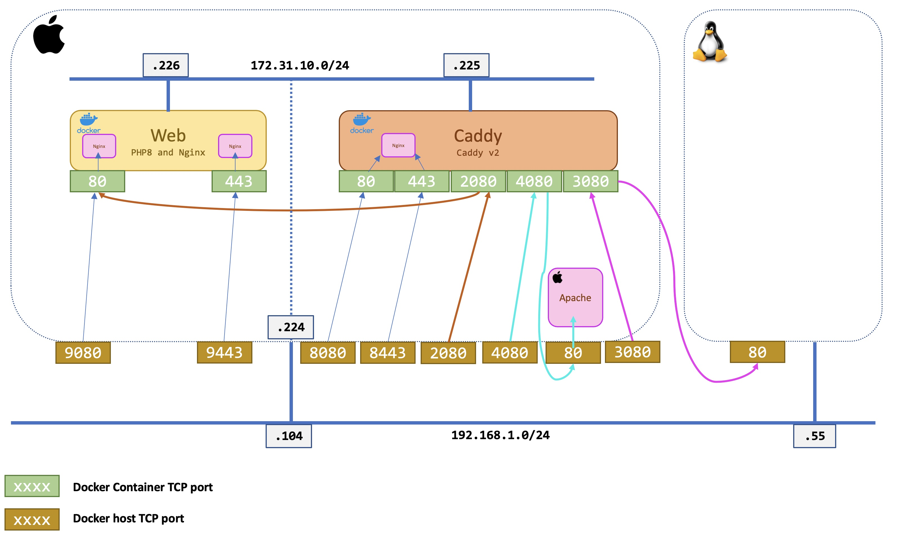

<!-- Improved compatibility of back to top link: See: https://github.com/othneildrew/Best-README-Template/pull/73 -->
<a name="readme-top"></a>
<!--
*** Thanks for checking out the Best-README-Template. If you have a suggestion
*** that would make this better, please fork the repo and create a pull request
*** or simply open an issue with the tag "enhancement".
*** Don't forget to give the project a star!
*** Thanks again! Now go create something AMAZING! :D
-->


<!-- PROJECT SHIELDS -->
<!--
*** I'm using markdown "reference style" links for readability.
*** Reference links are enclosed in brackets [ ] instead of parentheses ( ).
*** See the bottom of this document for the declaration of the reference variables
*** for contributors-url, forks-url, etc. This is an optional, concise syntax you may use.
*** https://www.markdownguide.org/basic-syntax/#reference-style-links
-->
[![Contributors][contributors-shield]][contributors-url]
[![Forks][forks-shield]][forks-url]
[![Stargazers][stars-shield]][stars-url]
[![Issues][issues-shield]][issues-url]
[![MIT License][license-shield]][license-url]
[![LinkedIn][linkedin-shield]][linkedin-url]


<!-- PROJECT LOGO -->
<br />
<div align="center">
  <a href="https://github.com/ddella/Caddy_Proxy">
    
  </a>

<h3 align="center">Caddy + Docker</h3>

  <p align="center">
    This is a simple example of a Caddy Docker container used a reverse proxy. I used this as part of a proof of concept to give and external partner access to a service inside our network.
    <br />
    <a href="https://github.com/ddella/Caddy_Proxy"><strong>Explore the docs »</strong></a>
    <br />
    <br />
    <a href="https://github.com/ddella/Caddy_Proxy">View Demo</a>
    ·
    <a href="https://github.com/ddella/Caddy_Proxy/issues">Report Bug</a>
    ·
    <a href="https://github.com/ddella/Caddy_Proxy/issues">Request Feature</a>
  </p>
</div>

<!-- TABLE OF CONTENTS -->
<details>
  <summary>Table of Contents</summary>
  <ol>
    <li>
      <a href="#about-the-project">About The Project</a>
      <ul>
        <li><a href="#built-with">Built With</a></li>
      </ul>
    </li>
    <li>
      <a href="#getting-started">Getting Started</a>
      <ul>
        <li><a href="#prerequisites">Prerequisites</a></li>
        <li><a href="#installation">Installation</a></li>
      </ul>
    </li>
    <li><a href="#usage">Usage</a></li>
    <li><a href="#roadmap">Roadmap</a></li>
    <li><a href="#contributing">Contributing</a></li>
    <li><a href="#license">License</a></li>
    <li><a href="#contact">Contact</a></li>
    <li><a href="#acknowledgments">Acknowledgments</a></li>
  </ol>
</details>

<!-- ABOUT THE PROJECT -->
## About The Project

Here's a blank template to get started: To avoid retyping too much info. Do a search and replace with your text editor for the following: `ddella`, `Caddy_Proxy`, `twitter_handle`, `daniel-della-noce-2176b622`, `email_client`, `email`, `project_title`, `project_description`

<p align="right">(<a href="#readme-top">back to top</a>)</p>

### Built With

* 

<p align="right">(<a href="#readme-top">back to top</a>)</p>


<!-- GETTING STARTED -->
## Getting Started

This is an example of *Caddy* as a Docker container used as a reverse proxy. The idea was to give an external partner access to a service in our network. The partner hits the Caddy container and he's redirected to another site internally. Our partner is using REST API on an internal server.  

The next step would be to deploy NGINX as an API gateway to add an extra layer of security.  
### Prerequisites
I needed a container with a small web server. I used a container that I had build some time ago. It's a container with Nginx and PHP8 with the famous **phpinfo()** page. You can use anything you want.  
[Nginx with PHP8](https://github.com/ddella/PHP8-Nginx)
### Diagram


- I run a Docker container called **web** for a simple web server.
  - It listens to `TCP/80` and `TCP/443`
- I run a Docker container called **caddy** for the reverse proxy.
  - It listens to `TCP/80`, `TCP/443`, `TCP/2080`, `TCP/4080` and `TCP/3080`
- I also run an external Apache web server on the Docker host.
  - It listens to `TCP/80`

### Traffic flow
This example is for educational purposes **ONLY**. It shows different scenarios where you want to use a reverse proxy.  

- `TCP/9080` on Docker host is mapped to `TCP/80` on the **web** container
- `TCP/9443` on Docker host is mapped to `TCP/443` on the **web** container

- `TCP/8080` on Docker host is mapped to `TCP/80` on the **caddy** container
- `TCP/8443` on Docker host is mapped to `TCP/443` on the **caddy** container

So far it's pretty boring and there's nothing special here.  

- `TCP/2080` on Docker host is mapped to `TCP/2080` on the **caddy** container, which reverse proxy to the **web** container `TCP/80`
- `TCP/3080` on Docker host is mapped to `TCP/3080` on the **caddy** container, which reverse proxy to an external server `TCP/80`
- `TCP/4080` on Docker host is mapped to `TCP/4080` on the **caddy** container, which reverse proxy to the Docker host `TCP/80`

This last two are the most interesting. It shows that you could give access to an external partner at a Docker container that will redirect the traffic to another server. 
### Installation

1. get the official Caddy container for Docker Hub
    ```shell
    docker pull caddy
    ```
2. get another container for testing (optionnal)
   ```shell
   git clone https://github.com/ddella/PHP8-Nginx.git
   ```
<p align="right">(<a href="#readme-top">back to top</a>)</p>

<!-- USAGE EXAMPLES -->
## Usage

Create a configuration file called `Caddyfile`  

    # Example of a "Caddyfile"
    :80 {
      # Set this path to your site's directory.
      root * /usr/share/caddy

      # Enable the static file server.
      file_server
    }

    :2080 {
      # Reverse proxy from Caddy container to another container
      reverse_proxy http://web
    }

    :3080 {
      # Reverse proxy from Caddy container to a server external to the Docker host
      reverse_proxy http://192.168.1.55
    }

    :4080 {
      # Reverse proxy from Caddy container to the Docker host Apache web server
      reverse_proxy http://192.168.1.104
    }

1. ### Start the `caddy` container:
The default config file simply serves files from `/usr/share/caddy`,
I added a volume to serve `index.html` from the current working directory:
```shell
docker run --rm -d -p 8080:80 -p 2080:2080 -p 3080:3080 -p 4080:4080 \
-v $PWD/index.html:/usr/share/caddy/index.html \
-v $PWD/Caddyfile:/etc/caddy/Caddyfile \
-v caddy_data:/data \
--name caddy \
--network frontend \
caddy
```
2. ### Start a simple web server to test the reverse proxy of Caddy
This could be any container with a web server. I happened to have one with Nginx and PHP8.
```shell
docker run --rm -d -p 9080:80 -p 9443:443 --network frontend \
--env TZ='EAST+5EDT,M3.2.0/2,M11.1.0/2' \
--env TIMEZONE='America/New_York' --name web php8_nginx
```

3. ### Tests
Test from the Docker host on web server. It's a simple Docker host to Docker container mapping. Nothing special here:
```
http://localhost:9080/
```
Output:  


Test from the Docker host to `caddy` container with reverse proxy to another Docker container.  
Compare to the previous example, the connection on the web server is from the `caddy` container at IP address `172.31.10.225`.
```
http://localhost:2080/
```
Output:  


Test from the Docker host to `caddy` container with reverse proxy to another the Docker **host** (the device that has Docker engine).  
For this test, I configured Apache on my macOS laptop, that's why we get the standard success page.  
```
http://localhost:4080/
```
Output:  


<p align="right">(<a href="#readme-top">back to top</a>)</p>

<!-- CONTRIBUTING -->

<!-- LICENSE -->
## License

Distributed under the MIT License. See [LICENSE.txt](LICENSE.txt) for more information.

<p align="right">(<a href="#readme-top">back to top</a>)</p>


<!-- CONTACT -->
## Contact

Your Name - [@twitter_handle](https://twitter.com/twitter_handle) - daniel@isociel.com

Project Link: [https://github.com/ddella/Caddy_Proxy](https://github.com/ddella/Caddy_Proxy)

<p align="right">(<a href="#readme-top">back to top</a>)</p>


<!-- ACKNOWLEDGMENTS -->
## Acknowledgments

* []()
* []()
* []()

<p align="right">(<a href="#readme-top">back to top</a>)</p>


<!-- MARKDOWN LINKS & IMAGES -->
<!-- https://www.markdownguide.org/basic-syntax/#reference-style-links -->
[contributors-shield]: https://img.shields.io/github/contributors/ddella/Caddy_Proxy.svg?style=for-the-badge
[contributors-url]: https://github.com/ddella/Caddy_Proxy/graphs/contributors
[forks-shield]: https://img.shields.io/github/forks/ddella/Caddy_Proxy.svg?style=for-the-badge
[forks-url]: https://github.com/ddella/Caddy_Proxy/network/members
[stars-shield]: https://img.shields.io/github/stars/ddella/Caddy_Proxy.svg?style=for-the-badge
[stars-url]: https://github.com/ddella/Caddy_Proxy/stargazers
[issues-shield]: https://img.shields.io/github/issues/ddella/Caddy_Proxy.svg?style=for-the-badge
[issues-url]: https://github.com/ddella/Caddy_Proxy/issues
[license-shield]: https://img.shields.io/github/license/ddella/Caddy_Proxy.svg?style=for-the-badge
[license-url]: https://github.com/ddella/Caddy_Proxy/blob/master/LICENSE.txt
[linkedin-shield]: https://img.shields.io/badge/-LinkedIn-black.svg?style=for-the-badge&logo=linkedin&colorB=555
[linkedin-url]: https://linkedin.com/in/daniel-della-noce-2176b622
[product-screenshot]: images/screenshot.png
[Next.js]: https://img.shields.io/badge/next.js-000000?style=for-the-badge&logo=nextdotjs&logoColor=white

